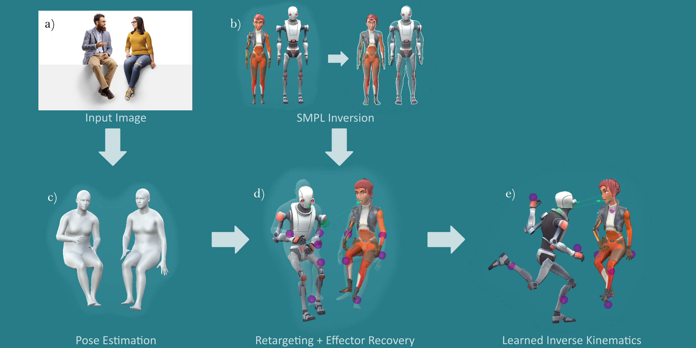

<p align="center">
  <h1 align="center">SMPL-IK</h1>

  <p align="center">
    Learned Morphology-Aware Inverse Kinematics for AI Driven Artistic Workflows https://arxiv.org/pdf/2208.08274.pdf
    <br>
  </p>
</p>



## Create workspace and clone this repository

```mkdir workspace```

```cd workspace```

```git clone git@github.com:boreshkinai/smpl-ik.git```


## Setup : Docker

```
docker build -f Dockerfile -t smpl-ik:$USER .

nvidia-docker run -p 18888:8888 -p 16006:6006 -v ~/workspace/smpl-ik:/workspace/smpl-ik -t -d --shm-size="1g" --name smpl-ik_$USER smpl-ik:$USER
```
go inside docker container
```
docker exec -i -t smpl-ik_$USER  /bin/bash 
```
launch training session
```
python run.py --config=protores/configs/experiments/h36m/protores_h36m.yaml
```

## Setup : Conda
```
conda create --name smplik python=3.8

conda activate smplik 

pip install -r requirements.txt -f https://download.pytorch.org/whl/torch_stable.html
```
To use notebooks (optional) :
```
conda install jupyter
```

## Citation

If you use SMPL-IK in any context, please cite the following paper:

```
@misc{voleti2022smplik,
  doi = {10.48550/ARXIV.2208.08274},
  url = {https://arxiv.org/abs/2208.08274},
  author = {Voleti, Vikram and Oreshkin, Boris N. and Bocquelet, Florent and Harvey, Félix G. and Ménard, Louis-Simon and Pal, Christopher},
  title = {SMPL-IK: Learned Morphology-Aware Inverse Kinematics for AI Driven Artistic Workflows},
  publisher = {arXiv},
  year = {2022}
}

```
